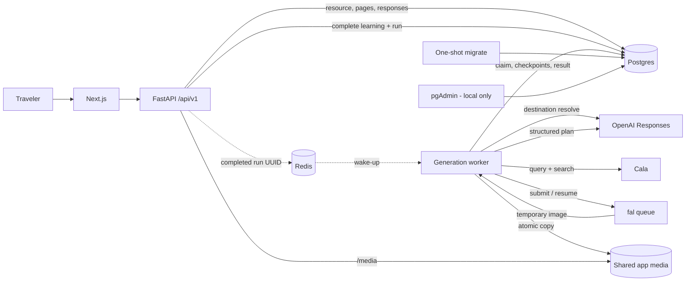

# Architecture overview

Status: The monorepo, integrated Next.js flow, catalog-backed preference learning, six-service runtime, durable worker, Cala/OpenAI/fal pipeline, checkpoints, and shared local media storage are **Current**. Production deployment/storage are **Open**.

## Current implementation

- `dev/frontend` creates itineraries, renders pair/single preference pages, records decisions, completes learning, polls generation, and renders terminal results/errors; it also serves the same-origin backend-health proxy.
- `dev/backend` exposes health, provider status, city/tag create/read, preference page/response/completion endpoints, OpenAPI, and generated files below `/media`.
- Revisions `20260829_0001` through `20260829_0004` own the Postgres schema.
- Compose runs frontend, backend, worker, Postgres, Redis, and pgAdmin after the one-shot migration. API and worker share a generated-media volume.
- Postgres owns resources, lifecycle, retries, leases/fencing, plan checkpoints, fal request checkpoints, and results. Redis carries only reconstructible run-ID wake-ups and worker health.
- The sequential worker performs real provider generation only after preference completion. The default preference algorithm uses deterministic catalog ranking and optional OpenAI adaptive reranking.
- New preference inventory is added in `dev/backend/app/data/activities.json`; its adjacent README documents the data-only contract.

## Component map

Postgres is authoritative. A lost Redis notification can delay pickup but cannot lose accepted work because reconciliation scans due Postgres rows independently. The media volume is application-owned local/demo storage, not the production durability decision.

## Public and readiness boundaries

- Application routes use the fixed `/api/v1` prefix. OpenAPI is the executable HTTP contract.
- The browser never calls Cala, OpenAI, fal, Postgres, or Redis directly.
- Public itinerary status is `pending`, `done`, or `fail`. Rich worker status and provider details remain private.
- `stage` is `learning_preferences`, `queued`, `researching`, `planning`, or `illustrating` only while pending; terminal resources return `stage: null`.
- `result` is non-null only for a complete `done`; `error` is non-null only for `fail`.
- Postgres is required for readiness. Redis is optional/degraded because durable work remains recoverable.
- Provider status reports redacted configuration presence, not reachability, quota, or billing.
- Missing provider keys do not prevent boot/readiness; the worker records `PROVIDER_CONFIGURATION_MISSING` for submitted work.

These boundaries are recorded in [ADR 0002](decisions/0002-backend-owned-provider-access.md), [ADR 0003](decisions/0003-generation-lifecycle.md), [ADR 0004](decisions/0004-natural-request-and-journal-artifact.md), [ADR 0005](decisions/0005-city-and-tags-input.md), and [ADR 0006](decisions/0006-preference-learning-before-generation.md).

## Current itinerary flow

1. `POST /api/v1/itineraries` cleans city/tags, fingerprints them, and commits an itinerary plus collecting preference session in `learning_preferences`; it creates no run.
2. The next-page API asks the injected algorithm for three initial pairs, persists all six immutable entries, then persists one category-learned adaptive page with one or two entries.
3. Like/dislike upserts remain tied to the itinerary and exact issued item.
4. Preference completion requires the six initial responses plus an answered adaptive page, invokes the algorithm update hook, atomically transitions to `queued`, creates one orchestration run, and best-effort appends its UUID to Redis.
5. The worker claims the run under a Postgres lease/fence and receives city, tags, and selected/rejected activity snapshots.
6. OpenAI resolves canonical destination/timezone; planned date is the immutable UTC creation date plus seven days.
7. Cala knowledge query and search use tags plus learned choices for grounded candidates/context.
8. OpenAI creates an English, three-to-five-place plan from the research and untrusted preference data.
9. The application validates and checkpoints the plan/illustration brief.
10. The worker submits or resumes one fal image and checkpoints its provider request ID.
11. It validates/copies the image into app-owned storage and atomically records the complete fenced result.
12. `GET` projects that state as `done`; any required-stage failure projects as `fail`.

## Checkpoint boundary and unavoidable gap

Plan and image-submission checkpoints are first-write/immutable and require the current unexpired lease owner/version. They prevent a retry from replanning or resubmitting after the respective commit.

No database transaction can atomically include fal accepting a network submission. If the process dies after fal returns a request ID but before that ID commits, the retry cannot know the original submission exists and may create a duplicate billable image. The implementation minimizes but cannot eliminate this gap; production hardening should monitor it or add provider-supported idempotency if available.

## Responsibilities

### Frontend

- Collect city/tags, render single/pair learning pages, record responses, complete learning, then poll/render generation states.
- Preserve the itinerary ID in route URLs so reloads resume existing durable work; honor backend `Retry-After` while polling.
- Render essential schedule/place/link information outside the generated image.
- Hold no provider credentials or provider-specific parsing.

### Backend API

- Own request validation, idempotency, public projection, safe errors, OpenAPI, and media serving.
- Own preference-page/item/response persistence and the injected catalog/ranking algorithm boundary.
- Persist completed learning and generation work before Redis notification.
- Never report `done` for an incomplete result.

### Worker

- Treat Redis UUIDs as hints and reconcile Postgres independently.
- Own provider orchestration, validation, checkpoints, retries, media copy, and fenced completion.
- Run sequentially in the current Compose topology.

### Postgres

- Store resource/result fields, preference sessions/pages/items/responses, stops, typed links/evidence, media metadata, generation attempts, leases, checkpoints, provider IDs, and safe errors.

### Redis

- Store reconstructible run UUID wake-ups and hostname-scoped worker heartbeat only.

### App-owned media

- Store the copied hero at an itinerary-scoped key and expose it below `/media`.
- Use a shared Compose volume locally. Production requires object storage/CDN, retention, deletion, and ACL decisions.

## Consistency rules

- Persist before notifying Redis.
- Do not create a generation run before preference learning is complete.
- Require the six initial responses, an answered adaptive page, and no unanswered issued item at completion.
- Planned date always uses the same creation-date-plus-seven-days rule across retries.
- Verified URLs must occur in Cala output; every place requires an app-built map link.
- A completed plan has three to five consecutive, non-overlapping places.
- `done` requires exactly one complete ready hero and all public result metadata.
- Checkpoint and terminal writes require the current run ID, owner, fence version, running state, and unexpired lease.
- Retryable failures use bounded attempts/backoff. Exhaustion is terminal `fail`.
- Provider/image errors are sanitized before persistence or HTTP output.
- API/worker startup never creates tables; migrations are explicit.

## Open production decisions

- Object storage/CDN, public media origin, retention/deletion, and access policy.
- Deployment topology, worker replicas, rate/cost limits, authentication/sharing, and observability.
- Final model IDs and live-provider latency/cost budget.

See [Domain model](domain-model.md), [API contract](api-contract.md), and [External integrations](integrations.md) for exact details.
